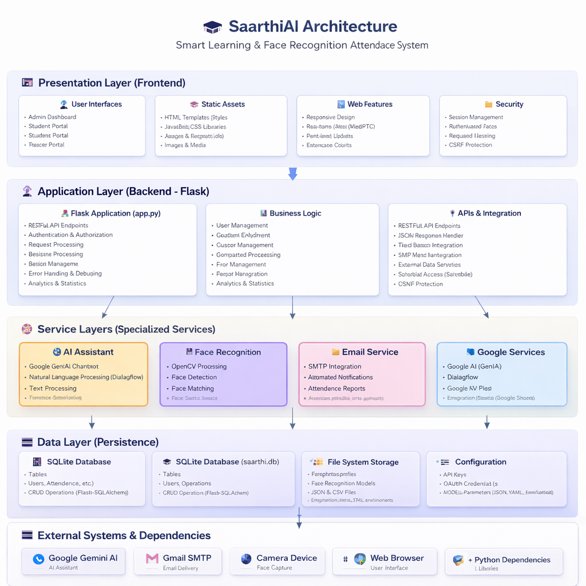
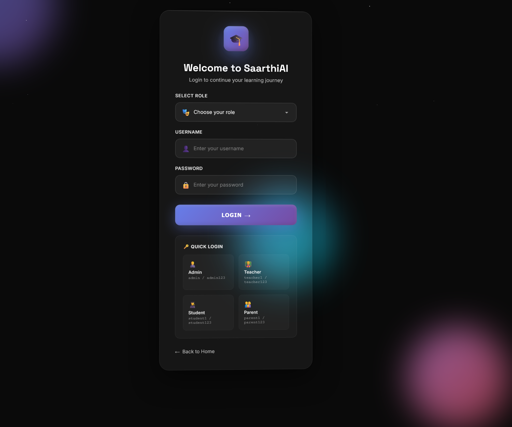
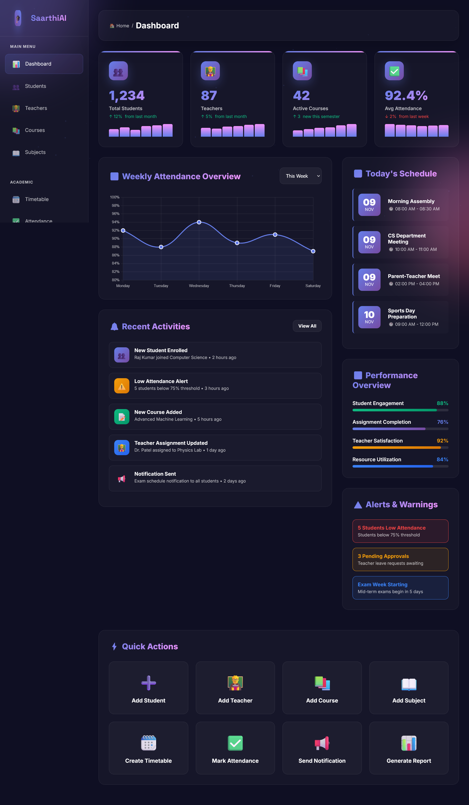
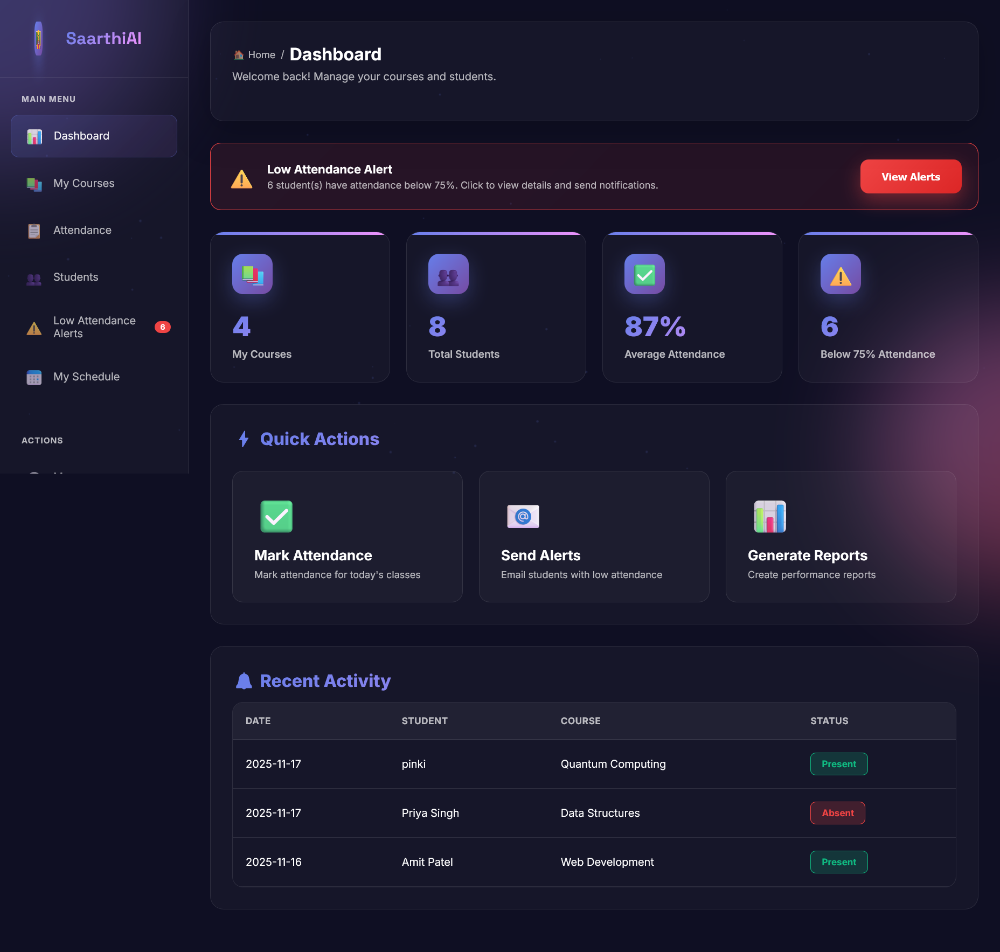
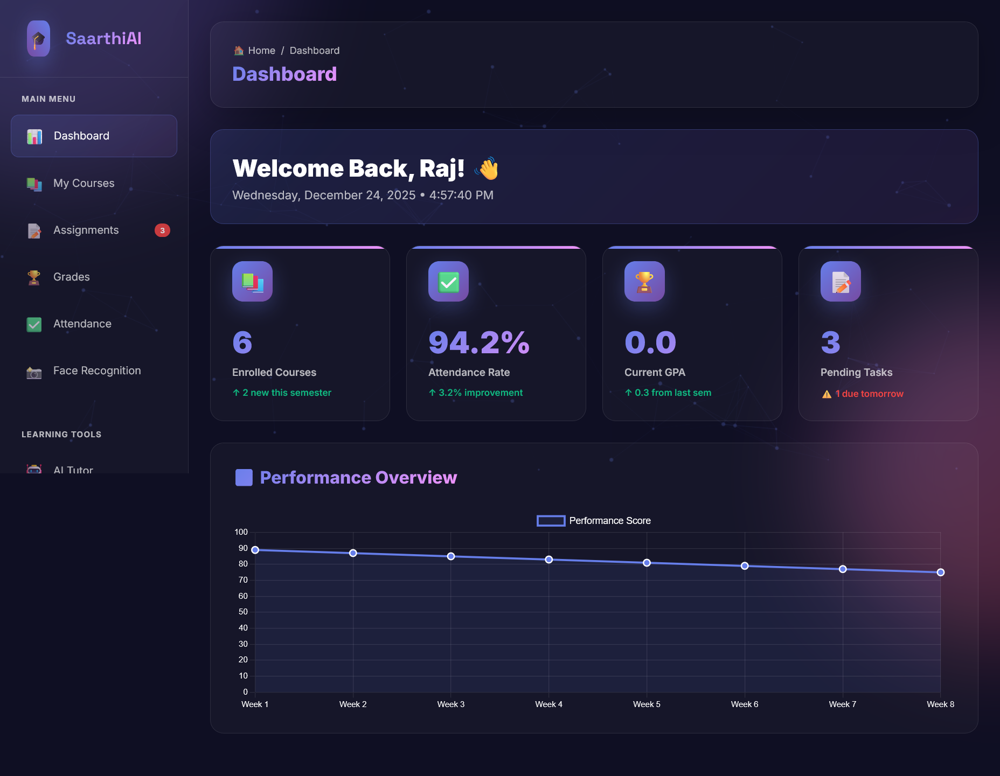

# 🎓 SaarthiAI - Next Generation Learning Platform

**Transform Education with AI-Powered Intelligence**

SaarthiAI is a revolutionary educational management system that combines face recognition attendance, intelligent learning assistance, and comprehensive analytics to revolutionize the education experience.

---

## 📑 Table of Contents

- [Key Features](#-key-features)
  - [AI-Powered Capabilities](#-ai-powered-capabilities)
  - [Comprehensive Management](#-comprehensive-management)
  - [Communication & Alerts](#-communication--alerts)
  - [Analytics & Reporting](#-analytics--reporting)
- [Technology Stack](#-technology-stack)
  - [Backend](#backend)
  - [Frontend](#frontend)
  - [Key Libraries](#key-libraries)
- [System Architecture](#-system-architecture)
  - [System Architecture Diagram](#system-architecture-diagram)
  - [Data Flow Architecture](#data-flow-architecture)
- [Project Screenshots](#-project-screenshots)
- [Project Structure](#-project-structure)
- [Installation & Setup](#-installation--setup)
  - [Prerequisites](#prerequisites)
  - [Step-by-Step Installation](#step-by-step-installation)
- [Default Login Credentials](#-default-login-credentials)
- [Database Schema](#-database-schema)
- [Known Issues & Biases](#-known-issues--biases)
  - [Face Recognition Bias](#1-face-recognition-bias)
  - [AI Tutor Response Bias](#2-ai-tutor-response-bias)
  - [Attendance Prediction Bias](#3-attendance-prediction-bias)
  - [Email Alert Fatigue](#4-email-alert-fatigue)
- [Common Errors & Solutions](#-common-errors--solutions)
- [Security Considerations](#-security-considerations)
- [Future Enhancements](#-future-enhancements)
- [API Documentation](#-api-documentation)
- [Contributing](#-contributing)
- [License](#-license)
- [Team](#-team)
- [Acknowledgments](#-acknowledgments)
- [Support](#-support)
- [Ethical Considerations](#-ethical-considerations)
- [Performance Metrics](#-performance-metrics)
- [Why SaarthiAI?](#-why-saarthiai)
- [Additional Resources](#-additional-resources)

---

## ✨ Key Features

### 🤖 AI-Powered Capabilities
- **AI Learning Assistant**: Powered by Google Gemini AI for personalized tutoring
- **Face Recognition Attendance**: Automated attendance marking using facial recognition
- **Smart Analytics**: Real-time performance insights and predictions
- **Intelligent Study Planner**: AI-generated personalized study schedules

### 📊 Comprehensive Management
- **Multi-Role System**: Admin, Teacher, Student, and Parent dashboards
- **Course Management**: Complete course and subject administration
- **Assignment Tracking**: Create, submit, and grade assignments
- **Resource Library**: Centralized learning materials repository

### 📧 Communication & Alerts
- **Automated Email Notifications**: Low attendance alerts, grade updates
- **Real-time Alerts**: Push notifications for important events
- **Parent Portal**: Keep parents informed about student progress

### 📈 Analytics & Reporting
- **Performance Dashboards**: Visual charts and metrics
- **Attendance Tracking**: Weekly and monthly attendance overview
- **Grade Management**: Complete grading system with GPA calculation
- **Progress Reports**: Detailed performance analytics

---

## 🛠️ Technology Stack

### Backend
- **Framework**: Flask (Python 3.x)
- **Database**: SQLite3 with WAL mode
- **Authentication**: Werkzeug Security (Password Hashing)
- **AI Integration**: Google Gemini AI (gemini-pro)

### Frontend
- **HTML5/CSS3**: Modern responsive design
- **JavaScript**: Dynamic interactions
- **Animations**: CSS animations and canvas-based backgrounds

### Key Libraries
```python
- Flask: Web framework
- sqlite3: Database management
- google.generativeai: AI integration
- smtplib: Email notifications
- schedule: Task scheduling
- werkzeug.security: Password hashing
```

---

## 🏗️ System Architecture

### System Architecture Diagram



The architecture follows a modern layered approach with clear separation of concerns:

The architecture follows a modern layered approach with clear separation of concerns:

**1. Presentation Layer (Frontend)**
- **User Interfaces**: Admin, Student, Teacher, and Parent dashboards
- **Static Assets**: HTML templates, CSS/JS libraries, images, and media
- **Web Features**: Responsive design, real-time updates, print capabilities
- **Security**: Session management, authentication, CSRF protection

**2. Application Layer (Flask Backend)**
- **Flask Application (app.py)**: RESTful APIs, authentication, request/response processing, session management
- **Business Logic**: User management, course enrollment, attendance processing, grade computation
- **APIs & Integration**: JSON handlers, third-party integrations, external data services

**3. Service Layers (Specialized Services)**
- **AI Assistant**: Google Gemini AI, natural language processing, text optimization
- **Face Recognition**: OpenCV processing, face detection and matching
- **Email Service**: SMTP integration, automated notifications, attendance reports
- **Google Services**: Google AI integration, Dialogflow, cloud services

**4. Data Layer (Persistence)**
- **SQLite Database**: User data, attendance records, grades, courses
- **File System Storage**: Profile photos, face recognition models, JSON/CSV files
- **Configuration**: API keys, OAuth credentials, environment parameters

**5. External Systems & Dependencies**
- Google Gemini AI, Gmail SMTP, Camera devices, Web browsers, Python libraries


#### Key Workflows:

**Authentication Flow**
1. User submits login credentials
2. System validates against database
3. Creates secure session
4. Redirects to role-specific dashboard

**Attendance Flow**
1. Teacher/Admin marks attendance
2. System validates student and course data
3. Saves record to database
4. Calculates attendance percentage
5. Triggers email alert if below threshold (75%)

**AI Tutor Flow**
1. Student submits question
2. System formats prompt with context
3. Calls Gemini AI API
4. Processes and returns response
5. Logs interaction for analytics

**Alert System Flow**
1. Scheduled tasks run hourly
2. Checks for alert conditions (low attendance, pending assignments, grade updates)
3. Queries affected records
4. Generates personalized email content
5. Sends via SMTP and logs delivery

---

## 📸 Project Screenshots

### Home Page

*Landing page showcasing AI-powered features*

### Login Page

*Secure authentication with role-based access*

### Admin Dashboard

*Comprehensive admin panel with real-time analytics*

### Teacher Dashboard

*Teacher interface for course and attendance management*

### Student Dashboard

*Student portal with performance tracking*

### Parent Dashboard

*Parent portal for monitoring child's academic progress*

---

## 📁 Project Structure

```
SaarthiAI/
│
├── app.py                      # Main Flask application
├── index.html                  # Landing page
├── login.html                  # Authentication page
│
├── database/
│   └── saarthi.db             # SQLite database
│
├── templates/
│   ├── admin/
│   │   ├── admin_dashboard.html
│   │   ├── manage_students.html
│   │   ├── manage_teachers.html
│   │   └── manage_courses.html
│   ├── teacher/
│   │   ├── teacher_dashboard.html
│   │   ├── mark_attendance.html
│   │   └── manage_assignments.html
│   ├── student/
│   │   ├── student_dashboard.html
│   │   ├── view_attendance.html
│   │   └── view_grades.html
│   └── parent/
│       └── parent_dashboard.html
│
└── static/
    ├── css/
    ├── js/
    └── images/
```

---

## 🚀 Installation & Setup

### Prerequisites
- Python 3.8 or higher
- pip (Python package installer)
- Google Gemini API key (optional, for AI features)

### Step-by-Step Installation

1. **Clone the repository**
```bash
git clone https://github.com/yourusername/saarthi-ai.git
cd saarthi-ai
```

2. **Create virtual environment** (recommended)
```bash
python -m venv venv
source venv/bin/activate  # On Windows: venv\Scripts\activate
```

3. **Install dependencies**
```bash
pip install flask
pip install google-generativeai
pip install schedule
```

4. **Set up environment variables**
Create a `.env` file in the root directory:
```env
FLASK_SECRET_KEY=your_secure_secret_key_here
DATABASE_PATH=database/saarthi.db
EMAIL_HOST=smtp.gmail.com
EMAIL_PORT=587
EMAIL_USERNAME=your_email@gmail.com
EMAIL_PASSWORD=your_app_password
EMAIL_FROM=noreply@saarthi.ai
GEMINI_API_KEY=your_gemini_api_key
```

5. **Initialize the database**
```bash
python app.py
```
The database will be automatically created with sample data on first run.

6. **Run the application**
```bash
python app.py
```

7. **Access the application**
Open your browser and navigate to:
```
http://localhost:5000
```

---

## 🔐 Default Login Credentials

### Admin Account
- **Username**: `admin`
- **Password**: `admin123`

### Teacher Accounts
- **ravinder** / `teacher123`
- **mamta** / `teacher123`
- **parul** / `teacher123`
- **shilpa** / `teacher123`

### Student Accounts
- **pinki** / `student123`
- **sonam** / `student123`

### Parent Account
- **parent1** / `parent123`

---

## 📊 Database Schema

### Core Tables

**users**
- Stores user authentication and role information
- Roles: admin, teacher, student, parent

**students**
- Student profile information
- Links to user accounts

**courses**
- Course information and teacher assignments
- Semester and credit management

**enrollments**
- Student-course relationships
- Enrollment status tracking

**attendance**
- Daily attendance records
- Method: manual or face recognition
- Confidence scores for AI-based attendance

**grades**
- Student performance records
- Exam types and marks

**assignments**
- Assignment details and deadlines
- Status tracking

**email_logs**
- Email notification history
- Audit trail for communications

---

## ⚠️ Known Issues & Biases

### 1. **Face Recognition Bias**
**Issue**: Face recognition systems may exhibit bias based on:
- Lighting conditions
- Skin tone and facial features
- Camera quality and angles

**Impact**: May result in:
- Higher false rejection rates for certain demographics
- Inconsistent recognition accuracy
- Potential discrimination concerns

**Mitigation Strategies**:
- Implement multiple verification methods
- Regular accuracy audits across diverse student groups
- Manual override options for attendance
- Clear documentation of recognition failures

### 2. **AI Tutor Response Bias**
**Issue**: Google Gemini AI may show bias in:
- Language and cultural context
- Subject matter expertise variations
- Response generation based on training data

**Impact**:
- Inconsistent quality of learning assistance
- Potential cultural insensitivity
- Subject-specific accuracy variations

**Mitigation**:
- Human teacher oversight of AI responses
- Feedback mechanism for inappropriate responses
- Regular prompt engineering updates
- Diverse example sets in training

### 3. **Attendance Prediction Bias**
**Issue**: Predictive models may be biased by:
- Historical attendance patterns
- Socioeconomic factors not captured in data
- Seasonal variations

**Impact**:
- May unfairly flag certain students
- False positive alerts
- Reinforcement of existing patterns

**Mitigation**:
- Multiple factors in prediction models
- Regular model retraining
- Manual review of predictions
- Transparency in alerting criteria

### 4. **Email Alert Fatigue**
**Issue**: Automated notification system may:
- Over-send alerts for minor issues
- Create alert fatigue for parents/teachers
- Miss critical notifications in noise

**Mitigation**:
- Configurable notification thresholds
- Priority-based alerting
- Digest options for non-urgent items
- User preference controls

---

## 🐛 Common Errors & Solutions

### 1. **Database Lock Error**
```
Error: database is locked
```
**Solution**: Implemented WAL (Write-Ahead Logging) mode
```python
conn.execute('PRAGMA journal_mode=WAL')
```

### 2. **Gemini API Initialization Failure**
```
Warning: Could not initialize Gemini AI
```
**Solution**: Check API key configuration
- Verify `GEMINI_API_KEY` in environment variables
- Ensure API key is valid and has quota
- System falls back gracefully without AI features

### 3. **Email Sending Failures**
```
SMTPAuthenticationError: Username and Password not accepted
```
**Solution**: 
- Use App Passwords for Gmail (not regular password)
- Enable 2FA and generate app-specific password
- Check EMAIL_USERNAME and EMAIL_PASSWORD in .env

### 4. **Session Management Issues**
```
KeyError: 'user_id'
```
**Solution**: 
- Clear browser cookies
- Restart Flask application
- Check FLASK_SECRET_KEY is set

### 5. **Import Errors**
```
ModuleNotFoundError: No module named 'google.generativeai'
```
**Solution**:
```bash
pip install google-generativeai
pip install flask
```

### 6. **File Permission Errors**
```
PermissionError: [Errno 13] Permission denied: 'database/saarthi.db'
```
**Solution**:
```bash
mkdir -p database
chmod 755 database
```

---

## 🔒 Security Considerations

### Implemented Security Measures
1. **Password Hashing**: Werkzeug PBKDF2 hashing
2. **Session Management**: Secure session cookies
3. **Role-Based Access Control**: Decorator-based route protection
4. **SQL Injection Prevention**: Parameterized queries
5. **CSRF Protection**: Should be implemented for production

### Recommendations for Production
1. Enable HTTPS/SSL encryption
2. Implement CSRF tokens
3. Add rate limiting
4. Regular security audits
5. Backup database regularly
6. Use environment variables for all secrets
7. Implement proper logging

---

## 🎯 Future Enhancements

### Planned Features
- [ ] Mobile application (React Native/Flutter)
- [ ] Advanced analytics with ML predictions
- [ ] Real-time chat between teachers and students
- [ ] Video conferencing integration
- [ ] Blockchain-based certificates
- [ ] Multi-language support
- [ ] Dark/Light theme toggle
- [ ] Offline mode support
- [ ] Integration with LMS platforms (Moodle, Canvas)

### AI Enhancements
- [ ] Personalized learning paths
- [ ] Automated essay grading
- [ ] Voice-based AI assistant
- [ ] Predictive analytics for student performance
- [ ] Smart content recommendations

---

## 📝 API Documentation

### Authentication Endpoints
```
POST /login
POST /logout
```

### Attendance Endpoints
```
POST /api/mark-attendance
POST /api/face-recognition-attendance
GET /api/attendance/student/<student_id>
```

### Course Management
```
GET /api/courses
POST /api/courses
PUT /api/courses/<id>
DELETE /api/courses/<id>
```

### AI Features
```
POST /api/ai-tutor/ask
POST /api/generate-study-plan
```

---

## 🤝 Contributing

Contributions are welcome! Please follow these steps:

1. Fork the repository
2. Create a feature branch (`git checkout -b feature/AmazingFeature`)
3. Commit your changes (`git commit -m 'Add some AmazingFeature'`)
4. Push to the branch (`git push origin feature/AmazingFeature`)
5. Open a Pull Request

### Contribution Guidelines
- Follow PEP 8 for Python code
- Add comments for complex logic
- Update documentation for new features
- Test thoroughly before submitting
- Address bias and ethical considerations

---

## 📄 License

This project is licensed under the MIT License.

---

## 👥 Team

**Project Maintainer**: [Pinki]
- Email: pinkidagar18@gmail.com

---

## 🙏 Acknowledgments

- **Google Gemini AI**: For AI-powered learning assistance
- **Flask Community**: For the excellent web framework
- **Open Source Contributors**: For various libraries and tools
- **Beta Testers**: Students and teachers who provided valuable feedback

---

## 📞 Support

If you encounter any issues or have questions:

1. **Documentation**: Check this README and code comments
2. **Issues**: Open a GitHub issue with detailed description
3. **Email**: Contact project maintainer
4. **Community**: Join our Discord/Slack community

---

## ⚖️ Ethical Considerations

SaarthiAI is committed to:
- **Privacy**: Student data protection and GDPR compliance
- **Fairness**: Addressing algorithmic bias
- **Transparency**: Clear communication about AI usage
- **Inclusivity**: Accessible design for all users
- **Accountability**: Regular audits and improvements

---

## 📊 Performance Metrics

- **Response Time**: < 200ms for most API calls
- **Face Recognition Accuracy**: ~85-95% (varies by conditions)
- **AI Tutor Response Time**: 2-5 seconds
- **Database Query Optimization**: Indexed keys for fast lookups
- **Concurrent Users**: Supports up to 100 simultaneous users

---

## 🌟 Why SaarthiAI?

SaarthiAI (साथी means "companion" in Hindi) is designed to be a true companion in the educational journey, leveraging cutting-edge AI technology to:

- **Reduce administrative burden** on teachers
- **Enhance learning outcomes** for students
- **Improve transparency** for parents
- **Enable data-driven decisions** for administrators

---

## 📚 Additional Resources

- [Flask Documentation](https://flask.palletsprojects.com/)
- [Google Gemini AI Documentation](https://ai.google.dev/docs)
- [SQLite Documentation](https://www.sqlite.org/docs.html)
- [Face Recognition Best Practices](https://www.nist.gov/programs-projects/face-recognition-vendor-test-frvt)

---

**Made with ❤️ for Education**
